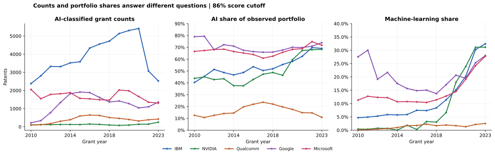
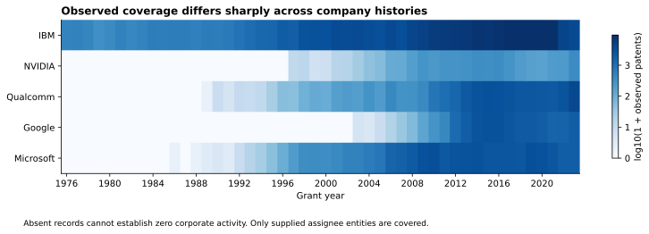
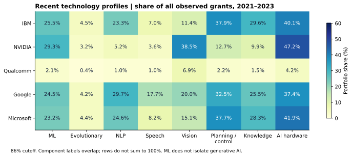
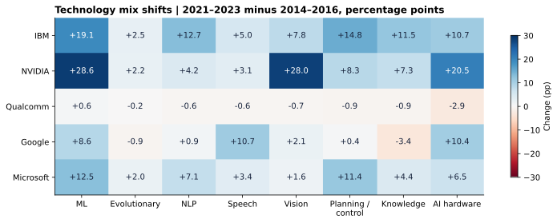
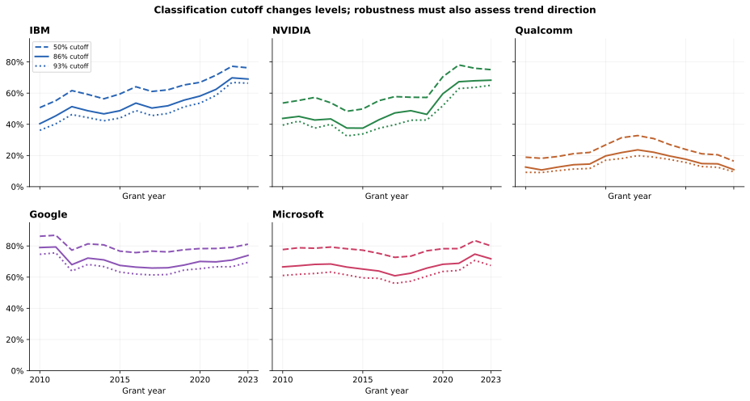
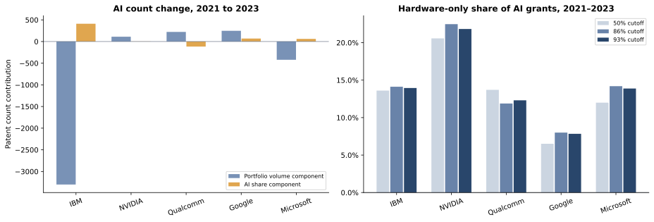

# AI-related patent activity: five technology companies

Independent exploratory study of the supplied U.S. patent extract • grant years 1976–2023 • main comparative period 2010–2023 • main classification cutoff 86%. Analysis prepared 3 October 2026. The findings describe observed patents and classifier labels, not current 2026 activity, AI capability or innovation quality.

## Major findings

- NVIDIA’s captured portfolio shifts toward machine learning: 7 of 1,010 grants (0.7%) in 2014-2016 versus 230 of 786 (29.3%) in 2021-2023. The +28.6 percentage-point change is visible at all three score cutoffs. Its recent profile is especially concentrated in vision and hardware.
- IBM remains the largest captured AI grant producer. From 2021 to 2023 its AI-classified grant count falls from 5,416 to 2,526 (-53.4%), while AI share rises from 62.4% to 69.1%. A contracting portfolio and an increasing AI share coexist.
- Qualcomm’s AI counts and AI concentration diverge: 318 to 424 AI-classified grants from 2021 to 2023 (+33.3%), but portfolio share drops from 14.8% to 11.0%. Its broad AI share peaks in 2017 within the main window and then falls.
- Google and Microsoft have high recent broad AI shares, about 71.7% and 71.5%, but their long-window average trends mask declines and later recovery. Google has the highest recent NLP and speech shares among these captured entities.
- Company conclusions depend on the denominator, time window and AI definition. A lifetime patent-count ranking would confound company history, assignee coverage and portfolio size. The dataset alone cannot rank company AI capability.



Observed grant counts, broad AI portfolio shares and machine-learning shares. All three panels use the same 86% score cutoff.

## 1. Dataset audit and population

The source has 271,415 patent-company rows, 271,414 unique patents and 46 columns. It is not an AI-only dataset: 125,981 unique patents (46.4%) meet the 86% any-AI rule. All flag_patent values equal 1. Publication date therefore measures grant/issue date, not application date or invention date. Non-AI-classified records supply the captured-portfolio denominator.

Every document ID equals its patent merge ID; all identifiers follow utility/reissue formats; application IDs preserve leading zeros. There are no exact duplicates and no repeated patent-company memberships. Patent 7355601 is assigned to both IBM and Microsoft with identical document/classifier fields; both membership rows are retained, while pooled totals count it once. There are 143 valid reissue records. Only location_id is missing, in 230 records; no missing values are imputed.

All binary classification flags are nested across cutoffs, every score is in [0,1], every component flag agrees with its score cutoff, and each any-AI flag is the logical OR of eight component flags. The 93% flags use the corrected cutoff behavior. These are strong internal consistency checks; they do not measure merge recall or classification accuracy.

| company | rows | first_date | last_date | assignee_ids | missing_location |
| --- | --- | --- | --- | --- | --- |
| Google | 25520 | 2003-02-25 | 2023-12-26 | 1 | 60 |
| IBM | 159001 | 1976-01-06 | 2023-12-26 | 2 | 55 |
| Microsoft | 47352 | 1986-05-13 | 2023-12-26 | 2 | 45 |
| NVIDIA | 4491 | 1997-04-08 | 2023-12-26 | 2 | 9 |
| Qualcomm | 35051 | 1989-10-24 | 2023-12-26 | 3 | 61 |

The extract covers 10 assignee IDs. Google is represented by one GOOGLE LLC ID; IBM, Microsoft, NVIDIA and Qualcomm have multiple captured entity IDs. Assignee disambiguation, historical aliases, subsidiaries and acquisitions can alter corporate attribution. The upstream tables, release versions, company-selection code and unmatched rows are absent. Therefore internal key agreement cannot establish complete company coverage. All company shares are conditional on the supplied entity selection.



Coverage begins in different years. Zero cells represent no captured records, rather than proven absence of company invention.

## 2. Analytical design and transformations

The primary threshold is 86%, selected from USPTO’s methodology as a midpoint calibrated to historical aggregate prediction volumes. This is not a demonstrated 86% precision or a guarantee that an individual patent truly contains AI. The 50% and 93% flags provide sensitivity analyses. The dataset uses broad, overlapping technology categories; these are not labels for modern generative AI.

The main window is 2010-2023: all five companies have at least 156 grants per year and records in all 12 months. It removes severe early-company sparsity from the main trend comparison without deleting those rows from the dataset. Calendar completeness is a useful audit but cannot certify all company counts. Recent profiles use 2021-2023, compared descriptively with 2014-2016. The full source remains unchanged; the clean dataset retains all original rows and columns plus documented features.

- AI count: number of captured company grants whose any-AI flag is 1.
- AI/ML portfolio share: classifier-positive grant count divided by all captured grants for that company and year/period.
- Hardware-only: AI hardware positive and none of the other seven components positive. Nonhardware: at least one other component positive.
- Component breadth: number of positive component labels, allowing overlap. This measures classifier label breadth, not invention quality.
- Within-sample fraction: 1 divided by the number of included company labels for a document. This conserves selected-sample totals and is not a full ownership weight.
- Main estimates give each calendar year equal weight; a separate equal-year table contrasts this with patent-weighted pooling.

| analysis | reason | rows_excluded | rows_retained |
| --- | --- | --- | --- |
| clean dataset and full-history EDA | none | 0 | 271415 |
| main annual trends and equal-year comparison | outside calendar grant years 2010-2023 | 73599 | 197816 |
| recent technology profile and co-occurrence | outside grant years 2021-2023 | 234310 | 37105 |
| no-reissue sensitivity only | valid RE patents omitted as a sensitivity | 143 | 271272 |
| pooled unique document summary only | collapse co-assignee memberships to a single consistent document, retain both in main dataset | 1 | 271414 |
| small observed entity sensitivity only | omit assignee IDs comprising less than 1% of their company records in this extract | 673 | 270742 |

## 3. Company activity and technology differences

| Company | All grants, 2023 | AI grants, 86% | AI share | ML share |
| --- | --- | --- | --- | --- |
| IBM | 3,658 | 2,526 | 69.1% | 32.4% |
| NVIDIA | 369 | 252 | 68.3% | 31.2% |
| Qualcomm | 3,870 | 424 | 11.0% | 2.5% |
| Google | 1,838 | 1,359 | 73.9% | 28.0% |
| Microsoft | 1,820 | 1,306 | 71.8% | 27.7% |

In 2023 IBM has 2,526 captured AI-classified grants, exceeding the other individual companies, despite its recent contraction. NVIDIA has only 252; its important finding is a technology-mix shift, not absolute grant leadership. Google and Microsoft have similar broad AI shares, while their component profiles differ. Qualcomm’s denominator is mostly non-AI under this classifier, so its low share does not establish low technological sophistication.



Recent component shares use all captured grants as their denominator. Categories overlap; values do not sum to 100%.

During 2021-2023 NVIDIA’s vision share is 38.5% and AI-hardware share 47.2%, versus 11.4% and 40.1% for IBM. Google’s NLP share is 29.7% and speech share 17.7%, above the other captured firms. NVIDIA’s ML share is 29.3%, IBM’s 25.5%, Google’s 24.5%, Microsoft’s 23.2%, and Qualcomm’s 2.1%. These are observed portfolio composition effects, not classifier-adjusted measures of true invention.



Descriptive change from 2014–2016 to 2021–2023, in percentage points. Periods are post-EDA research choices and not independent confirmatory samples.

The early-to-recent ML share changes are +28.6 pp for NVIDIA, +19.1 pp for IBM, +12.5 pp for Microsoft, +8.6 pp for Google and +0.6 pp for Qualcomm at 86%. Counts also matter: NVIDIA’s ML count rises from 7 to 230 despite a smaller three-year total portfolio; IBM rises from 1,467 to 4,271; Microsoft from 817 to 1,406; Google changes from 1,316 to 1,198 while its ML share rises as the denominator contracts. This distinction prevents equating concentration with output.

Component co-occurrence is descriptive. For NVIDIA, ML and vision overlap in 173 of 786 recent grants, Jaccard 0.481 and phi 0.485. IBM’s ML/NLP phi is 0.460, and Microsoft’s is 0.452. These relationships can reflect complementary technologies, shared text or classifier error; no causal conclusion is justified. All 140 company/component pairs are exported, including less striking ones.

## 4. Exploratory statistical evidence

After EDA, ten primary tests were frozen: any-AI and ML annual-share slopes for every company, 2010-2023, at 86%. OLS estimates a transparent average linear projection of annual shares; HAC lag 2 and t(12) provide approximate temporal model intervals. Holm adjusts all ten primary p-values. Inferences are exploratory because the same data generated the hypotheses. No patent-level independence is assumed for these standard errors.

| Company | Outcome | Slope (pp/year) | 95% CI | Holm p (10 tests) |
| --- | --- | --- | --- | --- |
| IBM | Any AI | +1.88 | [+1.25, +2.52] | 0.0003206 |
| NVIDIA | Any AI | +2.17 | [+0.86, +3.47] | 0.02125 |
| Qualcomm | Any AI | +0.22 | [-0.61, +1.05] | 1 |
| Google | Any AI | -0.39 | [-1.22, +0.43] | 1 |
| Microsoft | Any AI | +0.31 | [-0.30, +0.91] | 1 |
| IBM | ML | +1.92 | [+0.81, +3.03] | 0.01877 |
| NVIDIA | ML | +2.43 | [+1.10, +3.77] | 0.01484 |
| Qualcomm | ML | +0.16 | [+0.10, +0.22] | 0.000761 |
| Google | ML | -0.13 | [-1.29, +1.04] | 1 |
| Microsoft | ML | +0.94 | [+0.08, +1.80] | 0.171 |


Effect sizes and marginal 95% intervals, in pp/year. Holm adjustment applies to the ten p-values, not the confidence intervals.

IBM and NVIDIA have positive long-window AI and ML average trends under the model. Qualcomm has a much smaller positive ML slope, +0.162 pp/year (95% CI +0.101 to +0.223); the effect is modest in portfolio terms despite its small adjusted p-value. Microsoft’s positive ML marginal interval does not survive the primary multiplicity correction. Google’s net full-window ML trend is inconclusive; its later recovery is visible descriptively and in the later-window sensitivity.

The linear assumptions are imperfect: residual serial structure and strong curvature occur in most series. Early ML fits extend below zero for IBM and NVIDIA, which rules out treating the linear fit as a probability forecast. Bounded empirical-logit sensitivity is included; it does not fix unknown classifier or capture error. With 14 years, HAC intervals remain approximate. The full statistical report supplies diagnostics, alternative methods and all effects.

## 5. Uncertainty and robustness



Threshold sensitivity changes portfolio-share levels materially; trend direction must be assessed separately.

Overall unique-patent AI counts are 151,407 at 50%, 125,981 at 86%, and 114,949 at 93%. Raising the cutoff from 50% to 93% reduces the count by 24.1%. This is definition sensitivity, not a confidence interval and not an estimated classifier-error rate. The observed high/low company-share separation persists, while precise levels depend on the chosen cutoff.

IBM and NVIDIA keep positive primary point slopes at all three cutoffs, with or without the 2022-2023 endpoint years, and after excluding hardware-only labels from the AI definition. Excluding reissues or small captured entities has minimal effect on primary slopes. Microsoft’s broad AI slope changes sign when the recent two years are omitted. Google’s ML slope changes from about -0.13 pp/year in 2010-2023 to +1.24 in 2014-2023. Qualcomm’s broad AI slope is about +0.22 over 2010-2023 but -0.75 over 2014-2023, confirming that one line masks a rise followed by a fall.

These sensitivity results are reported as alternative estimands, not selected for statistical significance. No confidence interval includes upstream omissions, unknown corporate-group mapping, family duplication or classifier calibration uncertainty. Dates reflect grant timing and patenting strategy; changes cannot be assigned to invention timing or corporate AI investment.

## 6. Anomalies investigated and retained

- IBM’s 2022 portfolio drops from 8,680 to 4,398 grants (-49.3%). Every month remains represented, and the principal observed assignee entity persists. IBM Research’s January 2023 account states that IBM had moved toward more selective patenting. This supports a plausible strategy interpretation, but is not a causal test and cannot rule out capture changes.
- NVIDIA’s total grants jump from 212 in 2022 to 369 in 2023 (+74.1%). Its 86% AI share is nearly unchanged (67.9% to 68.3%), so that one-year AI-count increase mostly reflects grant volume rather than another large mix shift. Application/grant lags, families and corporate mapping need external records to investigate further.
- Qualcomm’s portfolio expands substantially from 2021 to 2023. Absolute AI growth accompanies falling broad AI share; inspect whether non-AI communication-related grants account for the denominator growth using CPC/text data before interpreting strategy.
- Patent 7355601 is a valid IBM/Microsoft co-assignment within this extract. It is retained for company portfolios and collapsed only for pooled document totals.
- All 143 RE identifiers are valid reissues and retained. A sensitivity removes them; parent links are unavailable, so the main file is a grant-document dataset rather than a distinct-invention-family dataset.
- The 230 missing location IDs are retained. No geographic inference is attempted.
- Threshold-borderline examples and earliest company documents are exported for manual review. None is deleted because of a suspicious appearance.

A targeted primary-document check corroborates US7355601’s two assignees. It identifies a chain to US6862027, which is also captured under Microsoft, confirming related documents despite distinct application IDs. The shared document concerns graphics and processor data movement, with AI mentioned in game tasks; its hardware score is about 0.999. This illustrates the broad classifier category and warrants label review, rather than automatic reclassification. See the original patent and externally_reviewed_patent_case.csv.



Left: exact symmetric arithmetic decomposition of 2021–2023 AI-count changes. Right: hardware-only share among AI-classified grants; both definitions need explicit denominators.

For IBM, the 2,890-grant AI decline decomposes into -3,300.7 grants from portfolio volume and +410.7 from the share change. For Qualcomm, the +106 AI grants decompose into +222.0 from volume and -116.0 from the share change. This explains the accounting identity; it does not identify causes. NVIDIA’s hardware-only share among AI grants declines from 55.5% in 2014-2016 to 22.5% in 2021-2023 at 86%, consistent with a broader mix of classifier labels.

## 7. Modelling decision

The statistical trend models already contribute to the research objective. No additional ML prediction model is fitted: there is no independent target for innovation, impact or future activity. Predicting AI flags from supplied scores would reproduce their deterministic construction and leak the outcome. A random patent split would ignore time and unknown families. Forecasting through 2026 or assessing generative-AI capability is unsupported by this file, which ends in 2023.

## 8. Methodological limitations

- Merge completeness is unidentifiable: all observed matches can be correct even if many relevant records are missing.
- Assignee coverage is conditional and uneven; a full corporate group may include subsidiaries, acquisitions, aliases and assignment changes absent here.
- All documents are grants. Rejected, abandoned, pending or unpublished applications are absent; publication date is not an invention date. Recent application cohorts have unresolved grant outcomes even when calendar grant years are complete.
- Classifier labels are imperfect broad definitions. Score meaning and classification error can differ by company, component and technological era. The single extract is internally rule-consistent; that does not prove historical calibration invariance.
- One invention can generate related grants, continuations or reissues. Unique application numbers do not guarantee independent invention families.
- Only five selected companies are covered. These shares are within captured portfolios, not U.S. AI-patent market shares.
- Statistical hypotheses are post-EDA; multiplicity control does not turn them into independent confirmation. Strong curvature and 14-year temporal samples limit trend inference.
- Patent numbers/labels do not establish novelty, quality, scientific leadership, revenue, investment or causality. No current 2026 trend is measured.

## 9. Recommendations for further analysis

- First audit the original merge with a left join and anti-join counts by company/year. Preserve versions, mapping rules and unmatched IDs; this is the highest-priority unresolved validity check.
- Build an explicit corporate-entity mapping with effective dates and a sensitivity comparing core legal entities with an expanded group. Validate individual boundary cases rather than assuming all affiliates belong.
- Add filing dates, application status and family/reissue-parent links. Separate grant-output trends from filing-cohort trends and distinct invention families.
- Manually inspect a stratified sample across company, year, component and score band. Independent labels can estimate company/era-specific error and make classification uncertainty measurable.
- Use CPC subclasses and patent text/claims to investigate Qualcomm’s denominator expansion and NVIDIA’s ML/vision shift. Add fixed-window forward citations only if studying impact.
- Confirm the strongest exploratory patterns in a separate later data release or an independently assembled patent sample, with hypotheses and sensitivity rules specified before inspection.
- If forecasting is later requested, use time-separated validation and stable entity definitions. Do not forecast by training on deterministic label fields.

## 10. Reproducibility and deliverables

The bundle includes clean_patent_company.csv.gz; six numbered Python stages plus shared methods and a runner; eight PNG/SVG figures; all audit, EDA, statistical and robustness tables; separate data-quality and statistical reports; a modelling decision; a research log in JSONL and Markdown; a scope ledger; a feature dictionary; and source/environment verification records. The supplied original CSV is not copied into the bundle, remains unchanged, and is identified by SHA-256.

```bash
python -m pip install -r requirements.txt
python code/run_pipeline.py --input /path/to/five_big_tech_ai_patents.csv --output outputs
```

All source values were checked exactly after round-trip parsing, and all count summaries reconcile. No network is required to run the analysis once the four dependencies are installed. Reports embed their plots in the standalone HTML; SVGs are included for editing/export. All random-free stages are deterministic apart from incidental file metadata. Original CSV SHA-256: d34cf61d30554b30ddb6d8e7f06f7a3bc130799f643f95aef6c282d53de69e79

## Sources and interpretation of external context

- [USPTO dataset and release notes](https://www.uspto.gov/ip-policy/economic-research/research-datasets/artificial-intelligence-patent-dataset)
- [USPTO AIPD 2023 methodology, especially appendices D–E](https://www.uspto.gov/sites/default/files/documents/oce-aipd-2023.pdf)
- [IBM Research, How do you measure innovation?, 9 January 2023](https://research.ibm.com/blog/Ibm-innovation-2022)
- [Original patent US7355601, front page and continuation/text disclosures](https://patentimages.storage.googleapis.com/0b/8e/3c/ca176069e305fb/US7355601.pdf)

The primary methodology reference is Pairolero et al., The artificial intelligence patent dataset (AIPD) 2023 update, Journal of Technology Transfer (2025), doi:10.1007/s10961-025-10189-8. Source pages were reviewed on 3 October 2026. USPTO documentation supplies field/cutoff meanings and release-note context; IBM’s account supplies possible strategic context. All numerical company results in this report are calculated from the supplied CSV.