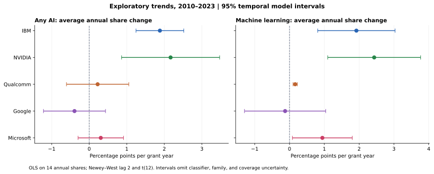
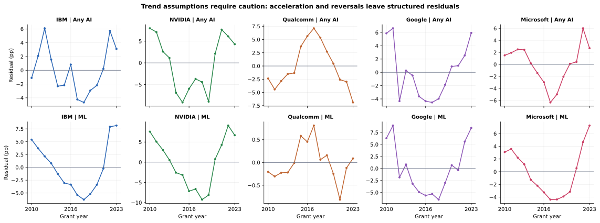

# Statistical analysis: exploratory annual portfolio trends

All tests are exploratory: hypotheses were formed after examining this same dataset. There is no held-out validation sample, preregistration, independent confirmation or causal identification. Deterministic descriptive counts/shares need no sampling intervals; the intervals below describe uncertainty under a hypothetical annual-process model.

The primary family contains ten two-sided zero-slope tests: any-AI and machine-learning share for each company at the 86% score cutoff, 2010-2023. Annual shares receive equal weight. The estimand is the average linear change in a calendar year’s observed portfolio share, not the probability that a randomly sampled patent is AI. Newey-West/Bartlett HAC lag 2 allows short serial dependence; covariance includes n/(n-2), and intervals/p-values use t with 12 degrees of freedom. Holm correction covers all ten primary p-values. Marginal 95% confidence intervals are not simultaneous intervals.

| Company | Outcome | Slope (pp/year) | 95% CI | Holm p (10 tests) |
| --- | --- | --- | --- | --- |
| IBM | Any AI | +1.88 | [+1.25, +2.52] | 0.0003206 |
| NVIDIA | Any AI | +2.17 | [+0.86, +3.47] | 0.02125 |
| Qualcomm | Any AI | +0.22 | [-0.61, +1.05] | 1 |
| Google | Any AI | -0.39 | [-1.22, +0.43] | 1 |
| Microsoft | Any AI | +0.31 | [-0.30, +0.91] | 1 |
| IBM | ML | +1.92 | [+0.81, +3.03] | 0.01877 |
| NVIDIA | ML | +2.43 | [+1.10, +3.77] | 0.01484 |
| Qualcomm | ML | +0.16 | [+0.10, +0.22] | 0.000761 |
| Google | ML | -0.13 | [-1.29, +1.04] | 1 |
| Microsoft | ML | +0.94 | [+0.08, +1.80] | 0.171 |

Annual linear-projection slopes with temporal model-based intervals. These omit classification and coverage uncertainty.

The strongest positive average trends are IBM and NVIDIA for broad AI and ML, plus Qualcomm for ML from a very low starting level. These survive the ten-test Holm correction under this model. Microsoft’s ML slope has a positive marginal interval, but its Holm-adjusted p-value is about 0.171; it is not a multiple-testing-confirmed result. Google’s full-window ML slope is near zero because a decline is followed by a recovery. A weak long-window slope does not establish that a company lacks technological progress.

## Assumption checks and robustness

There are only 14 observations per company. Annual residual correlations are about 0.49-0.85. Quadratic descriptive fits improve R-squared substantially in eight of ten series, so literal constant-slope assumptions are weak for those series. The linear ML fits for IBM and NVIDIA have negative fitted shares at the early endpoint; they are linear projection summaries, not valid probability forecasts. Empirical-logit sensitivity uses (count+0.5)/(denominator+1) for the transform only and yields bounded fitted shares. This correction is not written into the clean outcomes.

| company | outcome | linear_r2 | quadratic_r2_gain | lag1_residual_corr | fitted_min |
| --- | --- | --- | --- | --- | --- |
| IBM | any_ai | 0.842 | 0.055 | 0.512 | 0.415 |
| NVIDIA | any_ai | 0.673 | 0.231 | 0.7 | 0.358 |
| Qualcomm | any_ai | 0.047 | 0.702 | 0.814 | 0.149 |
| Google | any_ai | 0.142 | 0.658 | 0.489 | 0.68 |
| Microsoft | any_ai | 0.132 | 0.483 | 0.711 | 0.651 |
| IBM | ml | 0.733 | 0.226 | 0.807 | -0.007 |
| NVIDIA | ml | 0.728 | 0.223 | 0.809 | -0.071 |
| Qualcomm | ml | 0.73 | 0.074 | 0.512 | 0.003 |
| Google | ml | 0.01 | 0.857 | 0.646 | 0.196 |
| Microsoft | ml | 0.524 | 0.398 | 0.846 | 0.082 |

Residual patterns reveal acceleration and reversals; confidence intervals require a cautious model-based reading.

- Classification cutoffs: repeat all slopes at 50%, 86% and 93%; no sensitivity p-values are used to select a conclusion.
- Temporal specifications: HAC lags 1 and 3, HC3 intervals, leave-one-year-out slope ranges, and a Theil-Sen point estimate.
- Time windows: repeat 2010-2021 and 2014-2023. The latter describes a different estimand, not a replacement chosen for significance.
- Portfolio definitions: exclude valid reissues only as sensitivity; exclude observed entities below 1% of a company’s captured records; use any component other than hardware.
- Twenty secondary company-pair effects are fitted to annual difference series, retaining cross-company year covariance. Their pointwise intervals are exploratory and not simultaneous.

IBM and NVIDIA keep positive AI/ML point slopes across the checked definitions and windows. Google’s direction depends on the time window; Qualcomm’s broad AI reverses after its mid/late-2010s peak, and its short-window ML interval includes zero. Excluding reissues changes the largest primary slope by less than 0.01 pp/year. Removing the smallest captured entities changes the largest primary slope by about 0.01 pp/year. These checks address specific observed choices, not unknown subsidiaries or family dependence.

Classification scores are model outputs, not externally calibrated ground-truth probabilities for these five portfolios. Patent-level bootstrap or binomial intervals would ignore family/common-process dependence. None of the intervals include classifier error, entity-resolution error, unmatched merges or technological changes in score calibration. No causal effects or predictions beyond 2023 are asserted.