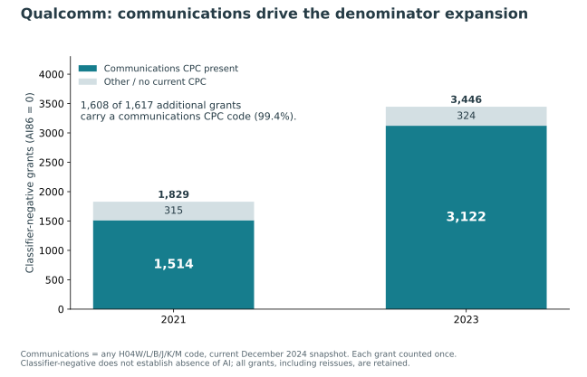
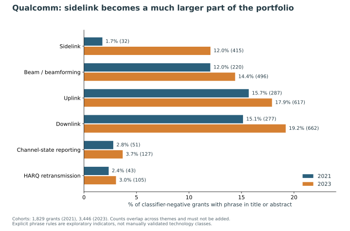
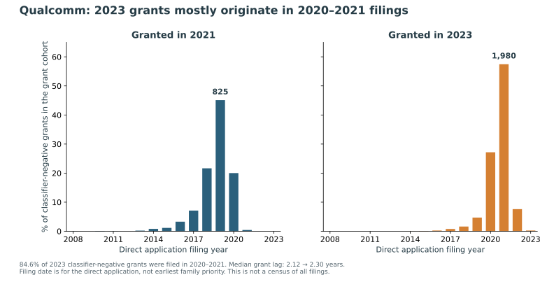
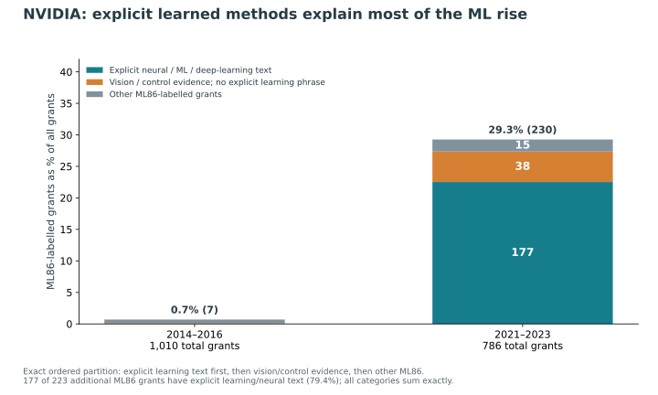
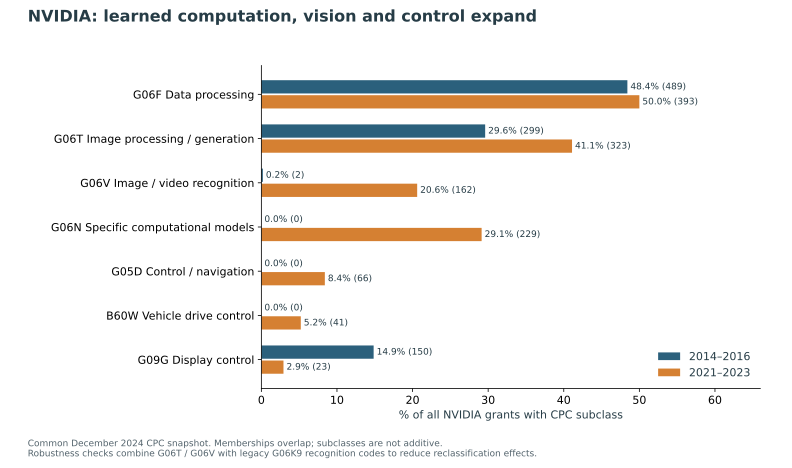
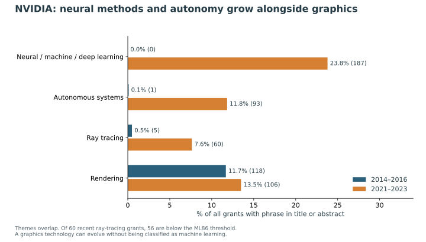

# What changed technologically? Qualcomm and NVIDIA

**Qualcomm's expanding classifier-negative denominator is overwhelmingly a communications-grant expansion, especially wireless networking and sidelink. NVIDIA's higher ML share is corroborated by explicit neural/learning text, image understanding, autonomous-system perception and selected accelerator inventions.** These are descriptive findings about granted patents in the supplied extract, not estimates of corporate R&D spending or causal strategy changes.

This extension examines Qualcomm's 2,147 grants in 2021 and 3,870 in 2023, plus NVIDIA's 1,010 grants in 2014–2016 and 786 in 2021–2023. Official [USPTO PatentsView metadata](https://zenodo.org/records/15783125), release dated 31 December 2024, supplies titles, abstracts, CPC classifications and direct application filing dates. Classifier-negative means supplied **any-AI86 = 0**; ML means **ML86 = 1**, not verified ground truth.

## Qualcomm: where the extra denominator comes from

Classifier-negative grants increase **1,829 → 3,446 (+1,617)**. Grants associated with communications CPC codes increase **1,514 → 3,122 (+1,608)**. Thus **99.4% of the net increase** lies in this category. The complementary category rises only 315 → 324. This is an exact two-way partition: a grant with any H04W, H04L, H04B, H04J, H04K or H04M code enters the communications category once, even when it has additional computing codes.

| CPC | Technology | 2021 negative grants | 2023 negative grants | Change |
| --- | --- | --- | --- | --- |
| H04W | Wireless networks | 1,322 | 2,820 | +1,498 |
| H04L | Digital information transmission | 1,088 | 2,125 | +1,037 |
| H04B | Transmission | 514 | 1,158 | +644 |
| G06F | Digital data processing | 111 | 110 | -1 |
| H01L | Semiconductors | 71 | 89 | +18 |

Subclass totals overlap and must not be added. The particularly large H04W increase and almost unchanged G06F count show that the extra denominator is concentrated in wireless communications, rather than a general expansion of conventional computing.

### What the communications patents describe

Title and abstract phrases identify **sidelink**, beam/beamforming techniques, uplink/downlink control, channel-state reporting and retransmission mechanisms. Sidelink mentions rise **32 → 415**, from **1.75% to 12.04%** of classifier-negative grants (+10.29 percentage points). Title-only sidelink mentions rise 21 → 355 (+9.15 pp), so the result does not rely on abstract wording alone. These are overlapping technical indicators, not exclusive validated topics.

For example, [US11546105B2](https://patents.google.com/patent/US11546105B2/en) concerns selective channel-state reports for a group of devices communicating over sidelink. [US11546031B2](https://patents.google.com/patent/US11546031B2/en) concerns feedback about wide-bandwidth beamforming. Both are classifier-negative at 86 and carry H04W/H04L/H04B codes. Their descriptions fit cellular-radio optimization. However, literal 'new radio/5G' phrase prevalence falls 6.45% → 3.92% under the disclosed rule; the evidence does **not** justify calling every additional communications patent a 5G patent.

### When this activity originated

**2,916 of the 3,446 classifier-negative grants in 2023 (84.6%) were directly filed in 2020–2021**; 1,980 were filed in 2021 alone. Of the 415 sidelink mentions, 399 are in those 2020–2021 filing cohorts. Median filing-to-grant lag increases only 2.12 → 2.30 years; the mean is 2.40 → 2.41 years, and the proportion with more than four years of lag falls 8.91% → 4.24%. The expansion is not concentrated in a very old backlog.

The supported mechanism is **a larger volume of communications applications reaching grant, mostly after a roughly two-year lag**. AI86-positive grants also increase 318 → 424 (+33.3%). Their share nevertheless falls 14.81% → 10.96% because negative grants grow much faster. A symmetric count decomposition assigns +3.26 pp to the positive-count change and −7.11 pp to the negative-count change, summing to −3.86 pp. This is arithmetic attribution, not a causal effect. Grant-only data cannot distinguish higher filing volume, different allowance rates, continuation practices or prosecution timing.

## NVIDIA: what accounts for the shift

ML86-labelled grants increase **7 → 230** despite total grants falling **1,010 → 786** across equal-length three-year windows. The ML share rises **0.69% → 29.26% (+28.57 pp)**. Independent text evidence is substantial: explicit neural/machine/deep-learning mentions rise **0 → 187 (23.79% of recent grants)**, with 113 appearing in titles. Of those 187 recent grants, 177 are ML86-positive.

An exact ordered partition separates the ML increase into: **177 additional grants with explicit learned-method text**; **37 additional grants with vision/control evidence but no explicit learning phrase** (1 → 38); and **9 additional remaining ML-labelled grants** (6 → 15). The explicit-learning category accounts for **79.4% of the +223 ML grant increase**. Vision/control evidence here means G06T/G06V membership, a disclosed perception/geometry phrase, or an autonomous-system mention; it is not a human-adjudicated invention taxonomy.

### The technologies are vision, learned computation and autonomy

Recent NVIDIA grants carry G06N specific-computational-model codes 229 times, compared with zero in the early cohort. Image processing/generation (G06T) rises 299 → 323; image/video recognition (G06V) rises 2 → 162; control/navigation (G05D) rises 0 → 66; and vehicle drive control (B60W) rises 0 → 41. These memberships overlap. **169 of the 230 recent ML grants (73.5%) have image/vision CPC evidence**, while 54 explicitly mention autonomous systems. The evidence points to learned visual perception and image synthesis, with autonomous-vehicle and computing implementation applications.

Concrete examples include [US10922793B2](https://patents.google.com/patent/US10922793B2/en), which generates missing image content using a neural network; [US10997433B2](https://patents.google.com/patent/US10997433B2/en), which uses learned image segmentation to identify driving lanes and boundaries; and [US10997492B2](https://patents.google.com/patent/US10997492B2/en), which concerns conversion to lower-precision formats. These illustrate image synthesis, autonomous perception and efficient numerical computation rather than a generic undifferentiated 'AI' category. They were selected deterministically for visible theme matches, not to estimate theme prevalence.

### Graphics continue alongside learned methods

Autonomous-system mentions rise **1 → 93**. Ray-tracing mentions rise **5 → 60**, but **56 of those 60 recent grants are ML86-negative**. Rendering mentions are **118 → 106**, while the share increases 11.7% → 13.5% because the later total is smaller. Digital data-processing CPC prevalence is roughly stable (48.4% → 50.0%). NVIDIA's portfolio therefore combines a substantial increase in learned methods and perception with ongoing graphics and computing activity; the evidence does not support treating all advanced graphics patents as ML.

## An anomaly that changes how classifier scores should be read

Three linked NVIDIA grants have the same sparse-convolutional-neural-network accelerator title, G06N/G06F codes and hardware86-positive labels, but radically different ML scores:

| Patent | ML score | ML86 | Any AI86 | Hardware86 |
| --- | --- | --- | --- | --- |
| 10891538 | 0.000484 | 0 | 1 | 1 |
| 10997496 | 0.999996 | 1 | 1 | 1 |
| 11847550 | 0.003449 | 0 | 1 | 1 |

The low-scoring 10891538 and 11847550 records have identical abstracts describing index-vector and coordinate computations; 10997496's abstract explicitly describes computations in a neural-network accelerator. The original [US11847550B2 patent PDF](https://patentimages.storage.googleapis.com/f0/33/3a/94de672370bfbf/US11847550.pdf) confirms a continuation relationship to 10891538 and a continuation-in-part chain involving 10997496. Its earliest listed provisional filing is 11 August 2016. Thus a 2023 grant can extend much older technical activity, and related patents can cross classifier component boundaries. Different claim scope, wording and classifier error remain possible explanations; this example does not establish which explanation is responsible.

Across the recent NVIDIA cohort, ten grants explicitly mention learned methods but are ML86-negative; nine are nevertheless any-AI86-positive. The exception, 11810268, describes neural-network image enhancement and falls below all supplied AI86 component flags. All ten are retained and exported for expert review. Literal text, CPC, broad AI labels and the ML component label measure different things.

## Uncertainty and robustness

- **Threshold and classification choice:** Qualcomm's communications share of net negative-grant growth ranges **98.6%–99.7%** across 50/86/93 cutoffs, current/at-issue CPC and all/inventional-only code choices.
- **CPC reclassification:** the official [2022 CPC notice](https://www.cooperativepatentclassification.org/sites/default/files/cpc/noc/CPCNoticeOfChanges202201/CPCNOC1250RP0760various.pdf) documents transfers involving G06K9 and G06V. A common snapshot plus a G06T/G06V/legacy-G06K9 union reduces this artifact. In paired cases with both snapshots, image/pattern share rises 29.5% → 50.0% using current codes and 28.3% → 48.9% at issue. These checks use 742 early and 784 recent NVIDIA grants; the main analysis retains all 1,796.
- **Text drafting:** raw bigram rankings contain boilerplate. Technical phrase rules and title-only checks corroborate the main themes, but are not a validated text classifier.
- **Quarter influence:** dropping one grant quarter at a time leaves Qualcomm's sidelink share increase at +9.68 to +10.67 pp, and NVIDIA's explicit-learning increase at +23.11 to +24.45 pp. These are robustness ranges, not confidence intervals.
- **Finite-cohort statistics:** reported counts and effects are exact for the specified rows. No new confirmatory p-values or sampling confidence intervals are manufactured: the cohort is a census of these supplied rows, patent families are not globally linked, and the Qualcomm windows supply only four quarters each. Semantic/classification uncertainty is assessed through alternative definitions; it cannot be repaired by a binomial confidence interval.

## Methods and transformations

All analysis is exploratory, including hypotheses motivated by the preceding EDA. No predictive model is fitted because it would add little to composition accounting and risk learning the supplied classifier outputs. Prespecified source/cohort selections, original labels, raw CPC rows, derived memberships, text rules and filing dates are retained. No rows in the 7,813-grant frame are removed from the main analysis. Six reissues lack current CPC and remain in an unknown/no-current-code category. One-to-many CPC memberships are deduplicated only for patent-level counting; fractional subclass credits are also supplied. Every significant decision and reasonable alternative is recorded in research_log.md.

## What would resolve the remaining 'why'

- Link patent families and earliest priorities. Recompute counts per family and distinguish new invention activity from continuation or reissue grants.
- Add the full population of published applications, including pending/non-granted records, and prosecution histories. Only this can separate a filing-volume wave from allowance or processing changes behind Qualcomm's grant growth.
- Review claims in a stratified, blinded sample: NVIDIA low-ML/high-hardware cases and Qualcomm communications cases with/without AI flags. Estimate labeling error with uncertainty from that validation sample.
- Extend CPC/text enrichment to intermediate years and all five companies. Use a held-out period or prespecified family-level study for confirmatory comparisons.